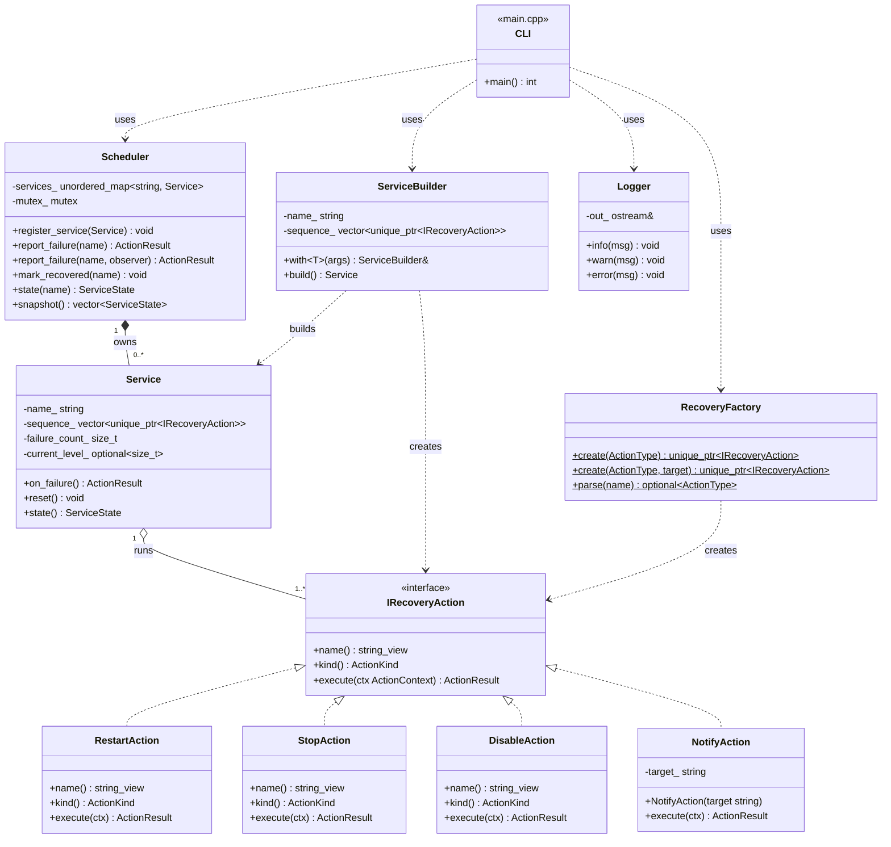
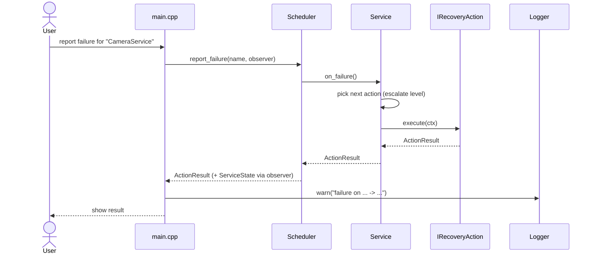

# Service Recovery Scheduler

This is a small C++ library with a demo program. It helps recover services when
they fail.

Every service has a list of actions to try when something goes wrong. The first
time a service fails, it runs the first action. If it keeps failing, it moves on
to the next action in the list. So the response gets stronger each time.

For example, a service might be set up like this:

```text
RESTART -> RESTART -> STOP -> DISABLE
```

The first two failures try a restart. The third one stops the service. The
fourth one disables it. If it fails again after that, it just keeps disabling.

## Technologies used

| Area | Technology |
| --- | --- |
| Language | C++17, C++20 |
| Build system | CMake 3.14 |
| Unit testing | GoogleTest and GoogleMock |
| Code coverage | gcovr and gcov |
| Reporting | GoogleTest JUnit XML plus HTML reports for tests and coverage |
| Compiler | Any C++17 or C++20 compiler |
| Standard library | `std::unique_ptr`, `std::optional`, `std::string_view`, `std::unordered_map`, `std::mutex`, `std::chrono` |

## Design patterns

- **Strategy**: each recovery action implements `IRecoveryAction`. A service
  keeps a list of them and runs them without knowing the exact type.
- **Factory**: `RecoveryFactory::create(ActionType)` makes an action from a
  choice made at runtime, for example during interactive registration. There is
  also a compile-time helper, `make_action<T>()`, used by `ServiceBuilder`.
- **Builder**: `ServiceBuilder` puts a service and its action list together with
  a simple, chained `with<T>()` call.
- **Dependency Injection**: `Logger` takes the output stream as a reference, so
  it does not depend on `std::cout` and is easy to test.
- **Observer**: `Scheduler::report_failure(name, observer)` calls back with the
  new state, so logging or metrics can be added without changing the library.

This also keeps the design close to SOLID. New actions can be added without
changing old code, each class does one job, and the scheduler depends on the
`IRecoveryAction` interface instead of the concrete actions.

## Build

You can build the project in two ways: with plain commands, or with the ready
made scripts.

### Way 1: Using commands

Configure and build:

```bash
cmake -S . -B build
cmake --build build
```

### Way 2: Using scripts

The scripts live in the `build_scripts/` folder and need a bash shell
(Git Bash, Cygwin or WSL).

- Clean build (deletes `build/` first, then builds from scratch):

  ```bash
  ./build_scripts/clean_build.sh
  ```

- Incremental build (only builds what changed, so it is faster):

  ```bash
  ./build_scripts/incremental_build.sh
  ```

## Test

You can run the tests in two ways too.

### Way 1: Using commands

```bash
cd build
ctest --output-on-failure
```

Note: this runs the tests but does not make the HTML reports.

### Way 2: Using a script

This script builds the tests, runs them, and also makes the HTML test and
coverage reports:

```bash
./build_scripts/test_and_coverage.sh
```

### Reports

The `test_and_coverage.sh` script writes its reports into `build/reports/`:

- Test report (HTML): `build/reports/tests/index.html`
- Test results (JUnit XML): `build/reports/tests/results.xml`
- Coverage report (HTML): `build/reports/coverage/index.html`

Current result: 100% line and branch coverage for library code.

## Run the demo

```bash
./build/srs_demo
```

The demo is an interactive, menu-driven CLI:

```text
==================================
 Service Recovery Scheduler
==================================
1. Register Service
2. Report Failure
3. Query Service
4. List Services
5. Reset Service
6. Exit
```

Key points about the demo:

- On start, it sets up four car services: `CameraService`, `GPSService`,
  `BluetoothService`, and `AudioService`. Each one has its own action list.
- Failures can be reported right away, and the response steps up each time.
- Option 1 adds a new service while the program runs. It asks for a name and the
  actions in order (`1 Restart  2 Stop  3 Disable  4 Notify`).
- Every action that runs is logged with a timestamp, for example
  `[2026-07-07 20:11:49] [WARN] failure on 'CameraService' -> stopping ...`.
- It can also read input from a pipe, so it is easy to run from a script.

## Architecture

The library is built in layers. The top layer talks to the user, the middle
layer holds the logic, and the bottom layer is the set of actions that can run.

### UML class diagram



### Failure flow (sequence)



What each part does:

| Component | Job |
| --- | --- |
| `main.cpp` | The menu-driven demo. Reads input and shows results. |
| `Scheduler` | Holds every service and picks the right one when a failure comes in. Thread-safe. |
| `Service` | One service with its own action list. Remembers where it is in the list. |
| `IRecoveryAction` | The common interface for an action. Restart, Stop, Disable, and Notify implement it. |
| `RecoveryFactory` | Creates an action when the type is chosen at runtime. |
| `ServiceBuilder` | Puts a service and its action list together in code. |
| `Logger` | Writes timestamped log lines to a given stream. |

What happens on a failure:

1. A failure is reported for a service by name.
2. The `Scheduler` finds that service.
3. The `Service` picks the next action in its list.
4. That action runs and returns a result.
5. The `Service` updates its state (level, last action, failure count).

## Coding standards

The project follows modern C++ style with MISRA C++:2023 ideas where practical.

Key rules used:

- include guards in headers (no `#pragma once`),
- braces for all control blocks,
- `[[nodiscard]]` where return values matter,
- `explicit` for single-argument constructors,
- `std::size_t` for indexes,
- no `using namespace` in headers,
- clean build with `-Wall -Wextra`.

